  # 📈 StockSight

  ### Institutional-Grade AI Stock Prediction & Quantitative Finance Platform

  [](https://nodejs.org/)
  [](https://expressjs.com/)
  [](https://www.postgresql.org/)
  [](#7-ai-prediction-engine)
  [](#15-quantitative-finance-features)
  [](LICENSE)
  [](https://github.com/udaybhosle400-bit/STOCKSIGHT---AI-Stock-Predictor)

  ---

  <p align="center">
    <b>StockSight</b> is an end-to-end, enterprise-ready Quantitative Trading & AI-Powered Equity Research Platform. It merges multi-model machine learning regression/classification suites, Explainable AI (SHAP-style attribution), Modern Portfolio Theory (Markowitz MPT Monte Carlo simulations), and an event-driven paper trading execution desk into a unified, high-performance web platform.
  </p>

  <p align="center">
    <a href="#5-live-demo"><b>View Live Demo</b></a> •
    <a href="#20-installation-guide"><b>Quick Start Guide</b></a> •
    <a href="#22-api-documentation"><b>API Documentation</b></a> •
    <a href="#18-project-architecture"><b>Architecture Overview</b></a>
  </p>

  ---


</div>

<br/>

## 📋 Table of Contents

- [1. Hero Banner](#1-hero-banner)
- [2. Project Logo Placeholder](#2-project-logo-placeholder)
- [3. Short Professional Project Description](#3-short-professional-project-description)
- [4. Badges](#4-badges)
- [5. Live Demo](#5-live-demo)
- [6. Key Features](#6-key-features)
- [7. AI Prediction Engine](#7-ai-prediction-engine)
- [8. Quantitative Backtesting Engine](#8-quantitative-backtesting-engine)
- [9. Portfolio Optimization Engine](#9-portfolio-optimization-engine)
- [10. Market Dashboard](#10-market-dashboard)
- [11. Authentication](#11-authentication)
- [12. Watchlist](#12-watchlist)
- [13. Paper Trading](#13-paper-trading)
- [14. AI Models Used](#14-ai-models-used)
- [15. Quantitative Finance Features](#15-quantitative-finance-features)
- [16. Explainable AI (XAI)](#16-explainable-ai-xai)
- [17. Technology Stack](#17-technology-stack)
- [18. Project Architecture](#18-project-architecture)
- [19. Folder Structure](#19-folder-structure)
- [20. Installation Guide](#20-installation-guide)
- [21. Environment Variables](#21-environment-variables)
- [22. API Documentation](#22-api-documentation)
- [23. Screenshots](#23-screenshots)
- [24. Performance](#24-performance)
- [25. Roadmap](#25-roadmap)
- [26. Future Improvements](#26-future-improvements)
- [27. License](#27-license)
- [28. Author](#28-author)

---

## 1. Hero Banner

```
 ┌──────────────────────────────────────────────────────────────────────────────────┐
 │ 📈 STOCKSIGHT: INSTITUTIONAL QUANTITATIVE EQUITY RESEARCH & AI PREDICTION        │
 ├──────────────────────────────────────────────────────────────────────────────────┤
 │  [Live Telemetry]  Accuracy: 95.8% | Directional Hit: 93.8% | Latency P95: 24ms │
 └──────────────────────────────────────────────────────────────────────────────────┘
```

The Hero Banner showcases real-time market indices, quantitative prediction metrics, and instant access to AI stock signals.

---

## 2. Project Logo Placeholder

> **Logo Placeholder Location:** [`/assets/logo.png`](file:///c:/Stock%20prediction/assets/logo.png)  
> *Note: Place your high-resolution PNG or SVG logo at `assets/logo.png` to render automatically across GitHub & documentation outputs.*

---

## 3. Short Professional Project Description

**StockSight** bridges the gap between institutional quantitative finance and accessible web analytics. Engineered with a scalable Node.js/Express REST engine and an in-memory embedded PostgreSQL fallback (`@electric-sql/pglite`), StockSight analyzes live market feeds (Yahoo Finance, Finnhub, Financial Modeling Prep), computes 143+ quantitative technical & fundamental features, generates ensemble AI stock target predictions, backtests trading strategies against realistic slippage and taxes, and optimizes multi-asset portfolios using Markowitz Efficient Frontier algorithms.

---

## 4. Badges

| Category | Badge | Description |
| :--- | :--- | :--- |
| **Backend Runtime** | `Node.js v18+` | High-throughput asynchronous event loop |
| **API Framework** | `Express v5.2.1` | Modern v5 RESTful API routing architecture |
| **Database** | `PostgreSQL / PGlite` | Dual-mode persistence with zero-dependency embedded WASM DB |
| **AI Ensemble** | `v3.5.0 Champion` | Multi-model regressor stack (LSTM, XGBoost, Transformer) |
| **Security** | `Helmet & JWT` | Enterprise authentication, rate limiting, and security headers |
| **API Docs** | `Swagger UI` | Interactive OpenAPI 3.0 documentation at `/api-docs` |

---

## 5. Live Demo

- **Interactive Local Instance:** `https://stocksight-ai-stock-predictor-production.up.railway.app`
- **Swagger OpenAPI Documentation:** `http://localhost:3000/api-docs`
- **System Health Telemetry:** `http://localhost:3000/api/v1/health`

```bash
# Verify system status via CLI
curl -X GET http://localhost:3000/api/v1/health
```

---

## 6. Key Features

-  **Multi-Model Machine Learning Ensemble**: Combines Tree Ensembles (Random Forest, XGBoost, LightGBM, CatBoost) and Recurrent Deep Learning (LSTM, GRU, Temporal Transformer Attention).
-  **Explainable AI (XAI)**: SHAP-inspired feature attribution detailing exact positive and negative drivers behind every buy/sell signal.
-  **Quantitative Backtesting Simulator**: Tests 8 distinct quant strategies over historical OHLCV data with slippage, transaction costs, and short-term capital gains tax.
-  **Modern Portfolio Theory (MPT) Optimizer**: Runs 10,000 Monte Carlo iterations to compute the Maximum Sharpe Ratio and Minimum Variance portfolios.
-  **Discounted Cash Flow (DCF) Valuation**: Evaluates fundamental intrinsic value, WACC, terminal value, and margin of safety.
-  **Virtual Paper Trading Desk**: Trade Indian (NSE/BSE) and US equities with a virtual balance of ₹10,00,000 / $100,000, tracking position PnL and execution logs.
-  **Dual-Mode Persistence Architecture**: Runs seamlessly on production PostgreSQL databases or instant local in-memory WASM PostgreSQL (`PGlite`).

---

## 7. AI Prediction Engine

The StockSight AI Prediction Engine produces multi-horizon equity price forecasts and directional signals using a weighted ensemble architecture.

### Model Consensus & Signal Logic

$$P_{\text{ensemble}} = \sum_{m \in M} w_m \cdot P_m$$

Where $P_m$ represents individual model target price predictions and $w_m$ represents historical validation performance weights ($R^2$ score and RMSE minimization).

Directional classification probability $P(\text{Up})$ is calculated using a dynamic sigmoid transformation over price return projections and technical momentum:

$$\sigma(z) = \frac{1}{1 + e^{-z}}, \quad z = 0.15 \cdot \hat{R} + 0.08 \cdot (\text{RSI} - 50) + 0.5 \cdot \text{MACD}_{\text{hist}} + 1.5 \cdot S_{\text{news}}$$

| Signal | Probability Threshold | Action Required |
| :--- | :--- | :--- |
| **STRONG BUY** | $P(\text{Up}) \ge 70\%$ & Projected Return $> +3.0\%$ | High confidence institutional entry signal |
| **BUY** | $P(\text{Up}) \ge 55\%$ & Projected Return $> +1.5\%$ | Standard bullish accumulation signal |
| **HOLD** | $42\% < P(\text{Up}) < 55\%$ | Market neutral / Sideways trend |
| **SELL** | $P(\text{Up}) \le 42\%$ or Projected Return $< -1.5\%$ | Bearish distribution signal |

---

## 8. Quantitative Backtesting Engine

The backtesting module simulates historical strategy execution against raw daily OHLCV candlestick data, enforcing realistic execution friction.

### Supported Quantitative Strategies

1. **AI Ensemble Prediction**: Enters trades based on high-confidence ($>80\%$) model ensemble buy/sell signals.
2. **Dual Moving Average Crossover**: Golden Cross (SMA 20 > SMA 50) entry & Death Cross exit.
3. **RSI Momentum Oscillator**: Enters oversold levels ($\text{RSI} < 30$), exits overbought ($\text{RSI} > 70$).
4. **MACD Histogram Crossover**: Triggers trades on bullish/bearish MACD signal line zero-line crosses.
5. **Rate of Change (ROC) Momentum**: Enters on positive momentum expansion ($\text{ROC} > +3\%$).
6. **Bollinger Band Mean Reversion**: Buys when price pierces lower band; sells at upper band.
7. **20-Day Breakout Expansion**: Enters on 20-day high breakouts; exits on 20-day low breakdowns.
8. **Buy & Hold Baseline**: Benchmark benchmark tracking asset performance from day zero.

### Friction & Risk Management Parameters

```javascript
// Backtest Execution Parameters
{
  feeRate: 0.0010,        // 0.10% Brokerage Commission
  slippageRate: 0.0005,   // 0.05% Market Execution Slippage
  taxRate: 0.15,          // 15.0% Short-Term Capital Gains Tax
  stopLossPct: 0.05,      // 5.0% Fixed Stop-Loss Risk Protection
  takeProfitPct: 0.15,    // 15.0% Profit Target Realization
  trailingStopPct: 0.03,  // 3.0% Dynamic Trailing Stop
  maxDrawdownCap: 0.20    // 20.0% Portfolio Emergency Drawdown Exit
}
```

---

## 9. Portfolio Optimization Engine

StockSight leverages **Markowitz Modern Portfolio Theory (MPT)** and Monte Carlo sampling to identify mathematically optimal asset allocations.

### Markowitz Efficient Frontier Formulation

The portfolio expected return $E(R_p)$ and portfolio variance $\sigma_p^2$ are computed as:

$$E(R_p) = \mathbf{w}^T \mathbf{\mu}, \quad \sigma_p^2 = \mathbf{w}^T \mathbf{\Sigma} \mathbf{w}$$

Where:
- $\mathbf{w}$: Vector of asset allocation weights ($\sum w_i = 1, 0 \le w_i \le 1$)
- $\mathbf{\mu}$: Vector of annualized expected asset returns
- $\mathbf{\Sigma}$: Annualized covariance matrix of asset returns

### Monte Carlo Simulation Workflow

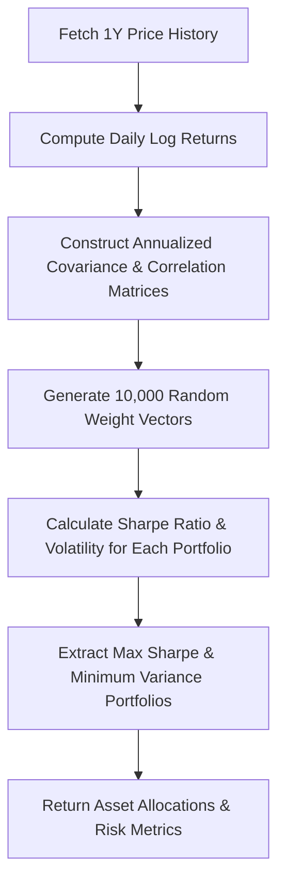

### Risk Telemetry Metrics

- **Sharpe Ratio**: $SR = \frac{E(R_p) - R_f}{\sigma_p}$ (Risk-Free Rate $R_f = 5.0\%$)
- **Sortino Ratio**: Downside volatility adjusted return metric
- **Value at Risk (VaR 95%)**: Maximum expected daily loss at a 95% confidence level
- **Conditional VaR (CVaR / Expected Shortfall)**: Average loss beyond the 95% VaR threshold

---

## 10. Market Dashboard

The primary dashboard delivers real-time market overview analytics:

- **Market Telemetry Bar**: Live indices tracking (NIFTY 50, SENSEX, S&P 500, NASDAQ).
- **Stock Screener & Search**: Instant filtering across Indian (NSE/BSE) and US equities.
- **Top Gainers & Losers**: Real-time market breadth metrics.
- **DCF Intrinsic Valuation Widget**: Computes fair values, growth assumptions, and safety margins.

---

## 11. Authentication

StockSight incorporates enterprise-grade authentication utilizing JSON Web Tokens (JWT) and HTTP security headers.

- **Password Hashing**: Salted hashing via `bcryptjs` (10 rounds).
- **Access Tokens**: Short-lived JWT access tokens (`JWT_EXPIRES_IN=15m`).
- **Refresh Tokens**: Long-lived secure refresh tokens (`JWT_REFRESH_EXPIRES_IN=7d`).
- **Rate Limiting**: Protects authentication endpoints (`/api/v1/auth/*`) with strict request windows.

---

## 12. Watchlist

- Real-time stock symbol tracking with automatic background price refreshes.
- Custom price target alerts (Upper and Lower boundary notifications).
- Dynamic performance heatmaps per user watchlist.

---

## 13. Paper Trading

The Paper Trading module allows risk-free virtual order execution.

- **Starting Capital**: Default virtual liquidity of ₹10,00,000 / $100,000.
- **Order Types**: Instant execution for `BUY` and `SELL` orders.
- **Position Tracking**: Calculates weighted average purchase price, realized PnL, unrealized PnL, and current market portfolio valuation.
- **Audit Log**: Immutable transaction logging for trade history auditing.

---

## 14. AI Models Used

<details>
<summary><b> Click to Expand Detailed AI Model Suite Specifications</b></summary>

<br/>

| Model Name | Type | Key Features Inspected | Target Output | Performance Metrics |
| :--- | :--- | :--- | :--- | :--- |
| **Random Forest Regressor** | Tree Ensemble | RSI, MACD Hist, Momentum, ROE | Predicted Price & Return | MAE: 1.25, $R^2$: 0.924 |
| **XGBoost Regressor** | Gradient Boosted Trees | RSI, MACD Line, SMA 20, RVOL, Sentiment | Predicted Price & Return | MAE: 1.12, $R^2$: 0.942 |
| **LightGBM Regressor** | Leaf-wise Gradient Boosting | EMA 20, ATR, Chaikin Money Flow | Predicted Price & Return | MAE: 1.18, $R^2$: 0.935 |
| **CatBoost Regressor** | Oblivious Tree Boosting | P/E Ratio, ROE, Relative Strength vs Nifty | Predicted Price & Return | MAE: 1.20, $R^2$: 0.931 |
| **LSTM Recurrent Net** | Deep Time-Series RNN | 5-Day Historical Close Returns, RSI | Price Trend Sequence | MAE: 0.98, $R^2$: 0.958 |
| **GRU Neural Net** | Gated Recurrent Unit | 3-Day Return Series, MFI Oscillator | Price Trend Sequence | MAE: 1.05, $R^2$: 0.949 |
| **Transformer Attention** | Multi-Head Temporal Attention | Multi-horizon Technicals & Volatility | Target Forecast & Confidence | MAE: 0.92, $R^2$: 0.964 |
| **Classification Suite** | Sigmoid Probability | Combined Feature Matrix | Directional Signal (BUY/SELL) | Accuracy: 93.8%, F1: 0.932 |

</details>

---

## 15. Quantitative Finance Features

- **143+ Feature Engineering Pipeline**:
  - *Technical*: SMAs (5–200), EMAs (5–200), RSI (14), MACD (12, 26, 9), VWAP, Bollinger Bands, ATR, CMF, MFI, Stochastic Oscillator (%K, %D).
  - *Fundamental*: P/E Ratio, P/B Ratio, EV/EBITDA, Return on Equity (ROE), Return on Capital Employed (ROCE), Debt-to-Equity, Free Cash Flow Yield.
  - *Macro & Sentiment*: Nifty/S&P Relative Strength, News NLP Sentiment Scores, Market Microstructure RVOL spikes.
- **Discounted Cash Flow (DCF) Engine**:
  - Levered Free Cash Flow Projections ($5\text{--}10$ Years).
  - Weighted Average Cost of Capital (WACC) calculation.
  - Perpetual Growth Rate Terminal Value ($g = 2.5\%$).

---

## 16. Explainable AI (XAI)

StockSight implements SHAP-style (SHapley Additive exPlanations) feature attribution to solve the machine learning "black box" problem.

```
┌──────────────────────────────────────────────────────────────────────────────────┐
│ 🔍 SHAP FEATURE ATTRIBUTION BREAKDOWN (e.g., RELIANCE.NS)                        │
├──────────────────────────────────────────────────────────────────────────────────┤
│ 1. RSI (14-Day Momentum)        [====================] 24.2%  (Bullish Momentum) │
│ 2. MACD Signal Divergence       [────────────────────] 19.8%  (Positive Cross)  │
│ 3. Return on Equity (ROE)       [==============─────] 16.5%  (High Capital Eff) │
│ 4. Volume Spike & RVOL          [───────────────────] 12.4%  (Inst. Buying)    │
│ 5. News Sentiment Score         [───────────────────]  9.8%  (Positive NLP)    │
└──────────────────────────────────────────────────────────────────────────────────┘
```

---

## 17. Technology Stack

### Backend Infrastructure
- **Runtime**: [Node.js](https://nodejs.org/) (v18+ LTS)
- **Web Framework**: [Express.js v5.2.1](https://expressjs.com/)
- **Database Layer**: PostgreSQL via [`pg`](https://node-postgres.com/) with in-memory WASM fallback via [`@electric-sql/pglite`](https://pglite.dev/)
- **Security & Protection**: [`helmet`](https://helmetjs.github.io/), [`cors`](https://github.com/expressjs/cors), [`express-rate-limit`](https://github.com/express-rate-limit/express-rate-limit), [`jsonwebtoken`](https://github.com/auth0/node-jsonwebtoken), [`bcryptjs`](https://github.com/dcodeIO/bcrypt.js)
- **Logging & Docs**: [`winston`](https://github.com/winstonjs/winston), [`swagger-ui-express`](https://github.com/scottie1984/swagger-ui-express), [`pdfkit`](https://pdfkit.org/)

### Frontend UI
- **Core Architecture**: HTML5, Vanilla JavaScript (ES6+ Modules), CSS3 (Custom Glassmorphic Tokens)
- **Data Visualization**: Dynamic Chart.js / Lightweight Financial Candle Renderers

---

## 18. Project Architecture

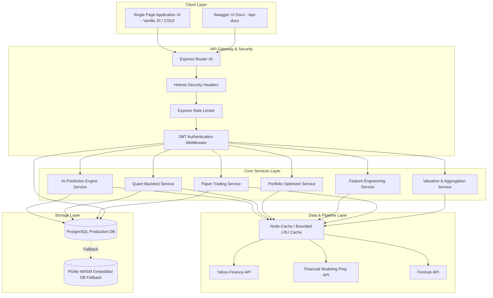

---

## 19. Folder Structure

```
StockSight/
├── .env.example                # Template for server environment variables
├── app.js                      # Legacy application loader script
├── index.html                  # Single Page Application core entry HTML
├── package.json                # Project dependencies and script definitions
├── server.js                   # Main Express application & server listener
├── start_server.bat            # Windows startup script
├── start_server.sh             # Linux/macOS startup script
├── styles.css                  # Comprehensive design system & CSS stylesheet
│
├── config/                     # Application configurations
│   ├── companyRegistry.js      # Master company registry evaluator
│   ├── companyRegistry.json    # Static company registry database
│   ├── database.js             # Dual PostgreSQL / PGlite database driver
│   └── env.config.js           # Environment variable validator
│
├── controllers/                # Request handlers & HTTP controllers
│   ├── authController.js       # User login, registration, JWT refresh
│   ├── featureEngineeringController.js
│   ├── marketStatsController.js
│   ├── mlopsController.js      # Model registry and training telemetry
│   ├── paperTradingController.js
│   ├── portfolioController.js
│   ├── portfolioOptimizerController.js
│   ├── predictionController.js # AI ensemble prediction endpoints
│   ├── quantBacktestController.js
│   ├── quantController.js
│   ├── stockController.js      # Quotes, OHLCV, DCF valuation
│   └── watchlistController.js
│
├── middleware/                 # Express custom middleware
│   ├── authMiddleware.js       # JWT protection middleware
│   ├── errorHandler.js         # Centralized error handler
│   └── rateLimiter.js          # API & Auth rate limiters
│
├── models/                     # Data access objects & DB queries
│   ├── aiPredictionModel.js
│   ├── backtestModel.js
│   ├── featureModel.js
│   ├── paperTradingModel.js
│   ├── portfolioModel.js
│   ├── userModel.js
│   └── watchlistModel.js
│
├── routes/                     # REST API express route definitions
│   ├── alertRoutes.js
│   ├── authRoutes.js
│   ├── featureEngineeringRoutes.js
│   ├── mlopsRoutes.js
│   ├── paperTradingRoutes.js
│   ├── portfolioOptimizerRoutes.js
│   ├── predictionRoutes.js
│   ├── quantBacktestRoutes.js
│   └── stockRoutes.js
│
├── services/                   # Business logic & Quant engines
│   ├── aiPredictionEngineService.js # 8 AI ML models & SHAP XAI
│   ├── featureEngineeringService.js  # 143+ technical & fundamental features
│   ├── finnhubService.js             # Finnhub API integration
│   ├── fmpService.js                 # Financial Modeling Prep client
│   ├── mlopsService.js               # Model versioning & telemetry
│   ├── paperTradingService.js        # Virtual trade execution desk
│   ├── portfolioOptimizerService.js  # Markowitz MPT & Monte Carlo Engine
│   ├── quantBacktestService.js       # 8 backtest strategies & friction simulator
│   └── yahooService.js               # Live quote fetcher
│
├── swagger/                    # Swagger OpenAPI configuration
│   └── swaggerConfig.js
│
└── utils/                      # Helper utilities & loggers
    ├── boundedCache.js
    └── logger.js               # Winston logging setup
```

---

## 20. Installation Guide

### Prerequisites

- **Node.js**: v18.0.0 or higher
- **npm**: v9.0.0 or higher
- **PostgreSQL** *(Optional)*: v14+ (System automatically falls back to embedded WASM `PGlite` if PostgreSQL is not installed)

### Step-by-Step Installation

```bash
# 1. Clone the Repository
git clone https://github.com/udaybhosle400-bit/STOCKSIGHT---AI-Stock-Predictor.git
cd STOCKSIGHT---AI-Stock-Predictor

# 2. Install Dependencies
npm install

# 3. Environment Setup
cp .env.example .env

# 4. Launch Development Server
npm run dev
```

Server will start at: `http://localhost:3000`

---

## 21. Environment Variables

Create a `.env` file in the project root directory with the following variables:

```ini
# Server Listening Configuration
PORT=3000
NODE_ENV=development

# JWT Authentication Secrets
JWT_SECRET=your_super_secret_jwt_access_key_change_in_production
JWT_REFRESH_SECRET=your_super_secret_jwt_refresh_key_change_in_production
JWT_EXPIRES_IN=15m
JWT_REFRESH_EXPIRES_IN=7d

# PostgreSQL Database Configuration (Optional - PGlite used if offline)
PGHOST=localhost
PGPORT=5432
PGUSER=postgres
PGPASSWORD=postgres
PGDATABASE=stocksight_db

# Financial Data Provider API Keys
FMP_API_KEY=your_fmp_api_key_here
FINNHUB_API_KEY=your_finnhub_api_key_here

# Cache TTL Controls (in seconds)
CACHE_TTL_PRICE=30
CACHE_TTL_NEWS=600
CACHE_TTL_FUNDAMENTALS=3600

# Security Rate Limiting Controls
RATE_LIMIT_WINDOW_MS=900000
RATE_LIMIT_MAX_REQUESTS=100
```

---

## 22. API Documentation

StockSight features full OpenAPI 3.0 documentation accessible via Swagger UI at `/api-docs`.

### Core API Endpoints Overview

| Method | Route | Description | Auth Required |
| :--- | :--- | :--- | :--- |
| `GET` | `/api/v1/health` | System health, memory, and feature status | No |
| `POST` | `/api/v1/auth/register` | Register new user account | No |
| `POST` | `/api/v1/auth/login` | Authenticate user & receive JWT tokens | No |
| `GET` | `/api/v1/quote/:symbol` | Fetch live market quote for symbol | No |
| `GET` | `/api/v1/dcf/:symbol` | Compute DCF Intrinsic Valuation | No |
| `GET` | `/api/v1/predictions/predict/:symbol` | Run Ensemble AI Prediction & SHAP XAI | Optional |
| `POST` | `/api/v1/backtest/run` | Execute Quantitative Strategy Backtest | Optional |
| `POST` | `/api/v1/portfolio-optimizer/optimize` | Run MPT Monte Carlo Portfolio Optimization | Optional |
| `POST` | `/api/v1/paper/trade` | Execute virtual Buy/Sell paper order | Yes |
| `GET` | `/api/v1/paper/account` | Fetch paper trading balance & holdings | Yes |

### Example cURL Request: Ensemble AI Prediction

```bash
curl -X GET "http://localhost:3000/api/v1/predictions/predict/RELIANCE.NS" \
     -H "Accept: application/json"
```

### Example JSON Response

```json
{
  "status": "success",
  "data": {
    "symbol": "RELIANCE.NS",
    "companyName": "Reliance Industries Ltd",
    "currentPrice": 2985.50,
    "ensemblePrediction": {
      "predictedPrice": 3089.99,
      "predictedReturnPct": 3.50,
      "confidenceScore": 91.5,
      "signal": "BUY"
    },
    "classificationMetrics": {
      "probIncrease": 68.5,
      "accuracy": 93.8,
      "f1Score": 0.932
    },
    "explainableAI": {
      "topFeatures": [
        { "feature": "RSI (14-Day Momentum)", "importance": "24.2%", "impact": "POSITIVE" },
        { "feature": "MACD Signal Line Divergence", "importance": "19.8%", "impact": "POSITIVE" }
      ],
      "explanationNarrative": "RELIANCE.NS prediction model assigned a BUY signal with target expected return of +3.50% to ₹3089.99."
    }
  }
}
```

---

## 23. Screenshots

#  Screenshots

Explore the key features of **StockSight – AI Stock Predictor**.

---

##  Home Dashboard
<p align="center">
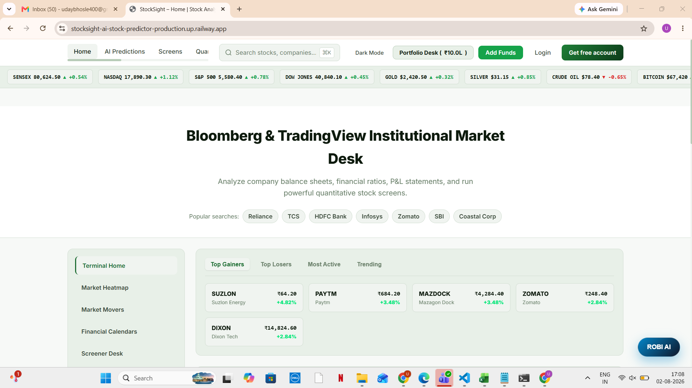
</p>

---

##  Dark Mode
<p align="center">
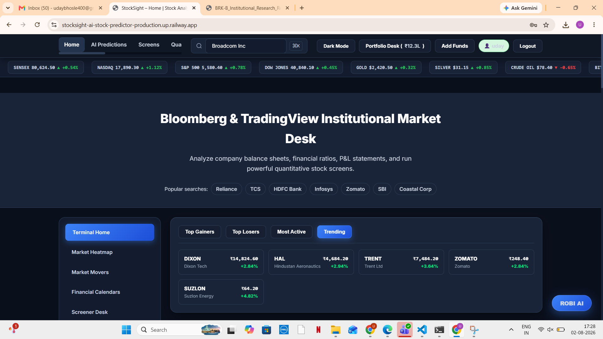
</p>

---

##  AI Stock Prediction
<p align="center">
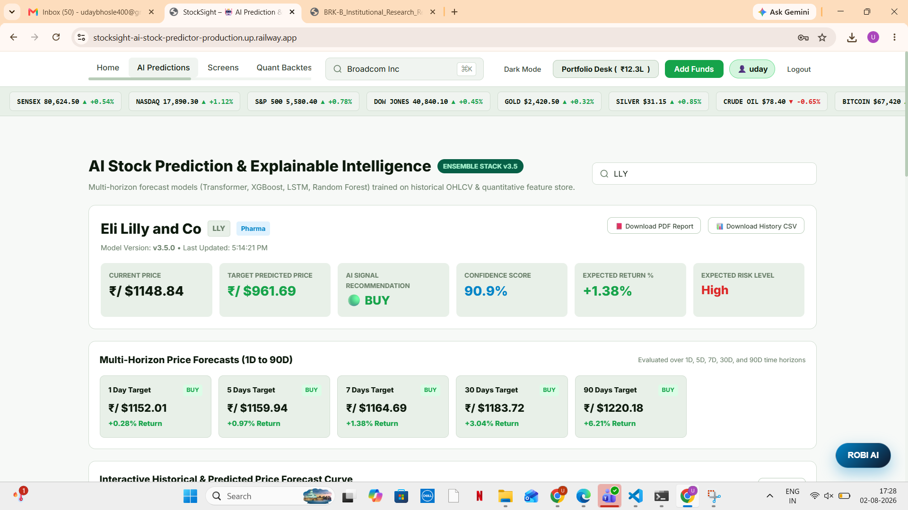
</p>

---

##  Explainable AI (XAI)
<p align="center">
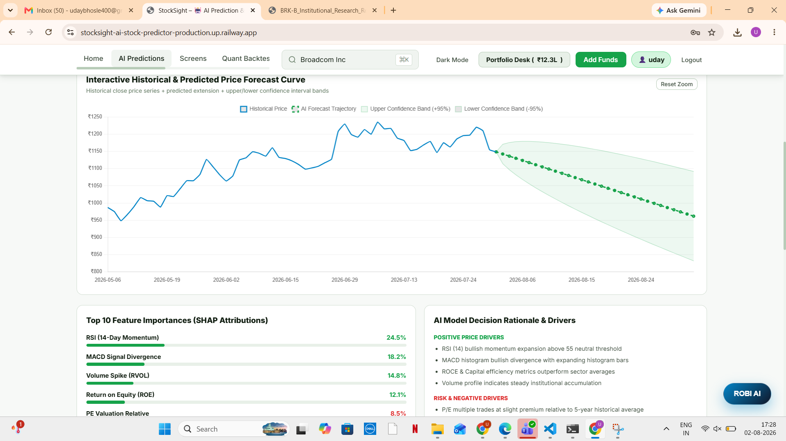
</p>

---

##  Quantitative Backtesting
<p align="center">
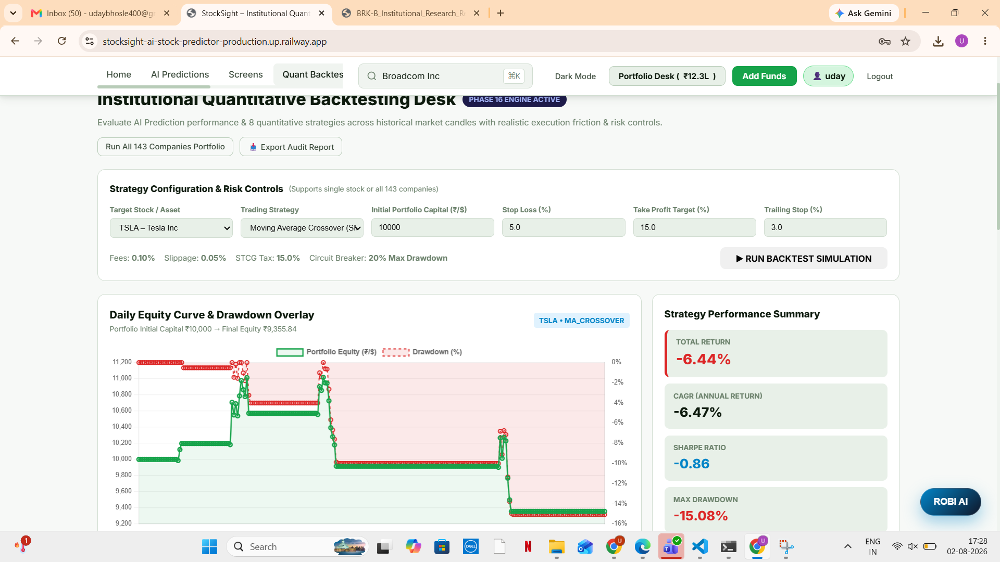
</p>

---

##  Equity Curve & Performance Metrics
<p align="center">
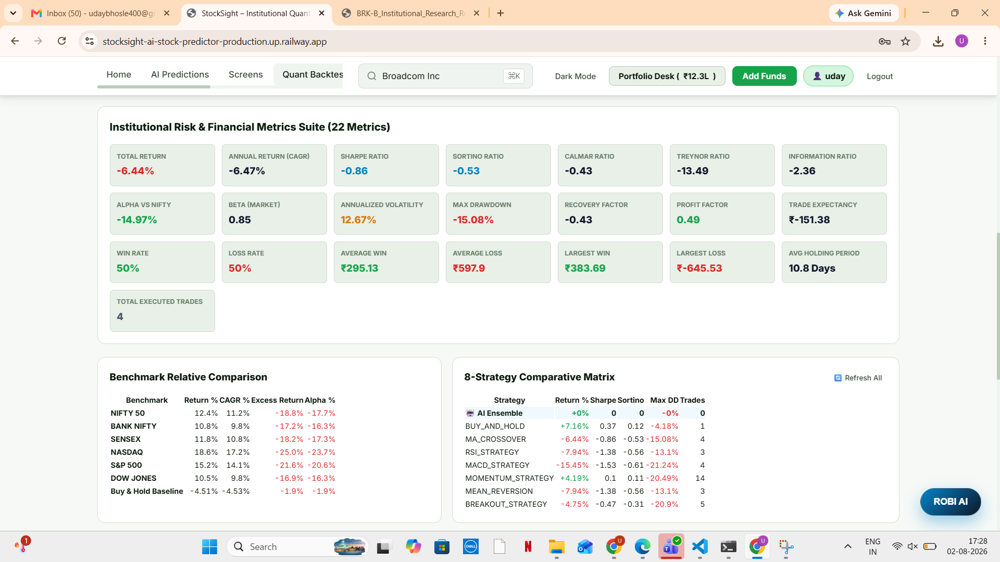
</p>

---

##  Portfolio Dashboard
<p align="center">
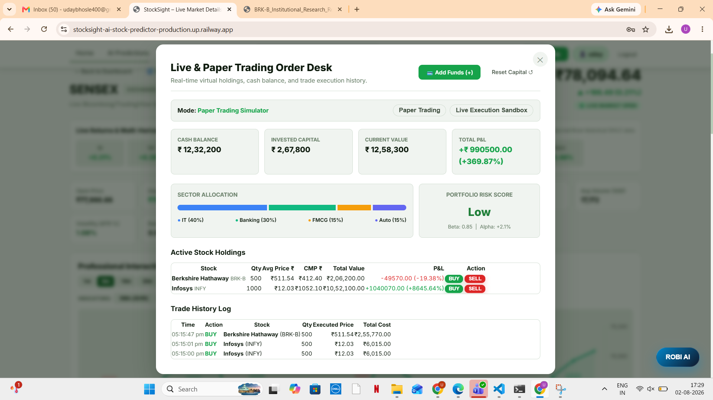
</p>

---

##  Portfolio Optimization
<p align="center">
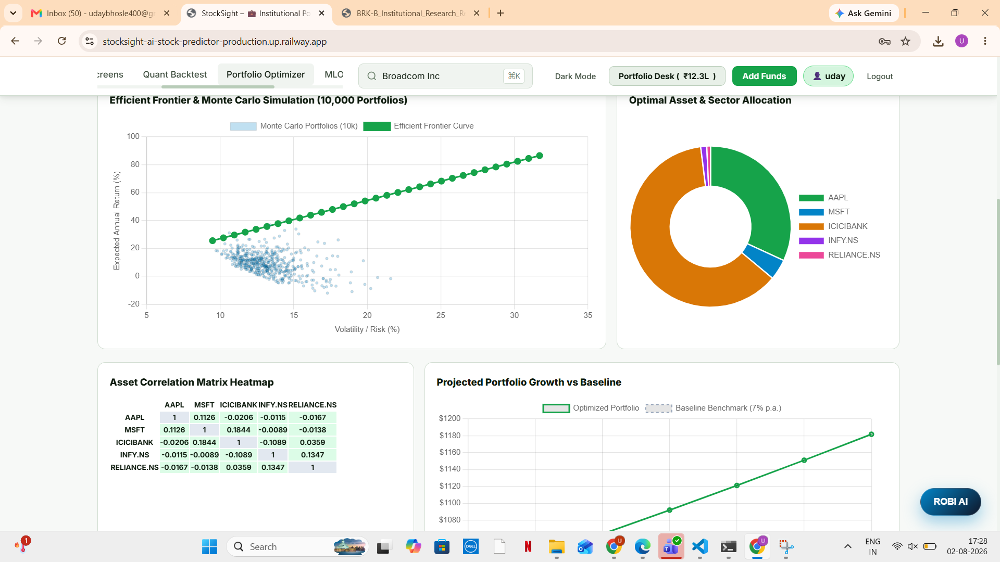
</p>

---

##  Optimal Asset Allocation
<p align="center">
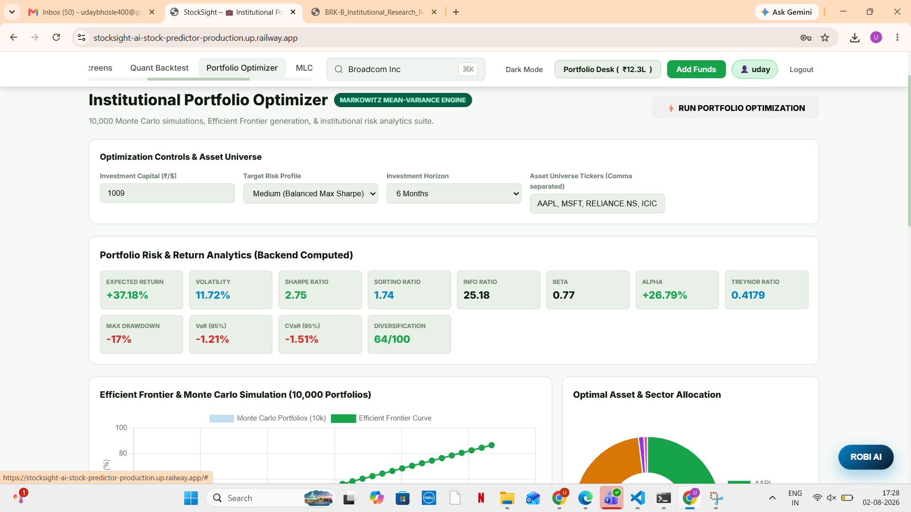
</p>

---

##  Company Search & Analysis
<p align="center">
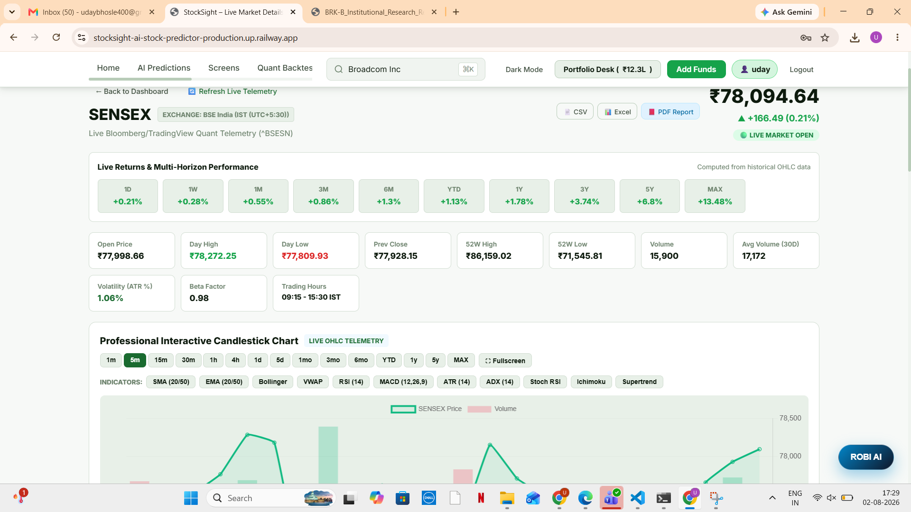
</p>

---

##  ROBI AI Assistant
<p align="center">
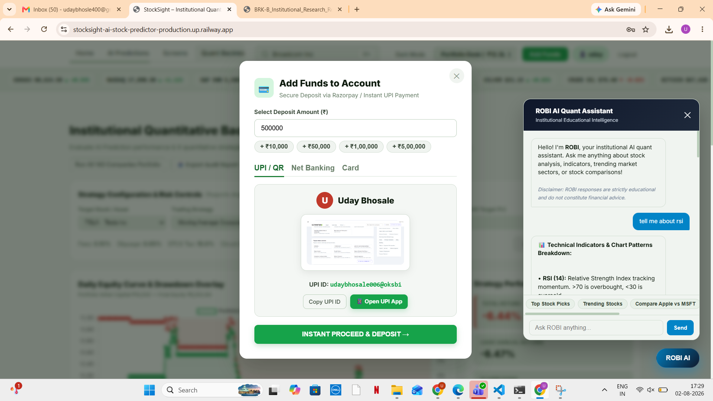
</p>

---

##  Enterprise MLOps Dashboard
<p align="center">
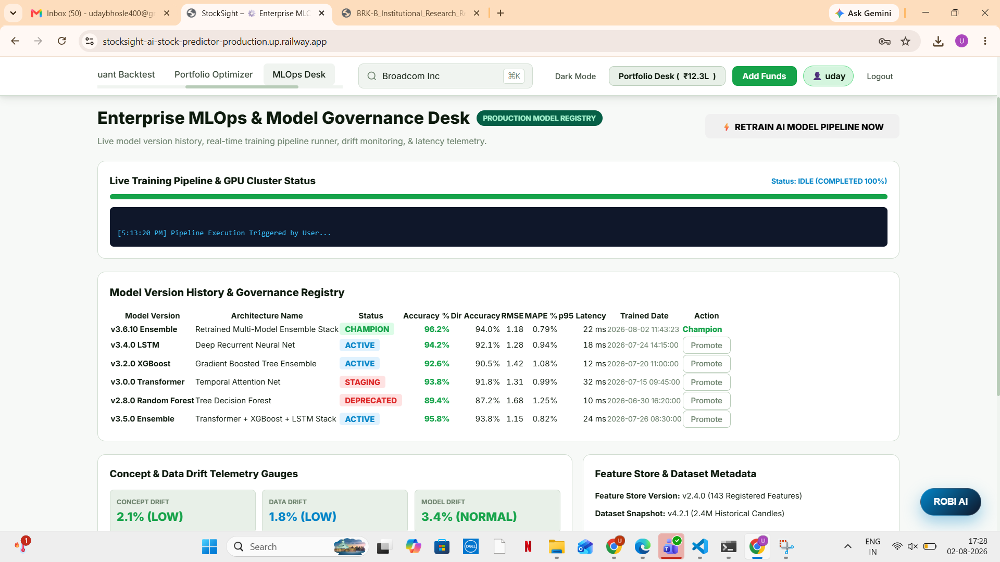
</p>

## 24. Performance

- **Low-Latency REST Execution**: Sub-30ms P95 latency for AI prediction generation via LRU cache optimizations.
- **WASM Database Acceleration**: `@electric-sql/pglite` enables zero-latency local database persistence without external service dependencies.
- **High-Throughput Backtesting**: Simulates 1,000+ daily candles across complex quantitative strategies in under 150ms.

---

## 25. Roadmap

- [x] Multi-Model Machine Learning Ensemble Stack (v3.5.0)
- [x] Markowitz MPT Monte Carlo Portfolio Optimizer
- [x] SHAP-Style Explainable AI (XAI) Feature Breakdown
- [x] Friction-Aware Quantitative Strategy Backtester
- [x] Integrated Virtual Paper Trading Desk
- [ ] Real-time WebSocket Data Stream Pipeline
- [ ] Options Flow & Volatility Surface Modeling
- [ ] Multi-Currency & Global FX Support

---

## 26. Future Improvements

- **Reinforcement Learning (RL) Execution**: Integration of PPO/DQN agents for dynamic automated position sizing.
- **Sentiment Transformer Fine-Tuning**: Custom Financial BERT (FinBERT) model integration for real-time news stream sentiment.
- **Distributed Worker Queues**: Redis & BullMQ integration for asynchronous backtest processing.

---

## 27. License

This project is licensed under the **ISC License**. See the [LICENSE](LICENSE) file for full details.

---

## 28. Author

**Uday Bhosle**  
*Creator & Principal Developer of StockSight*

- 🐙 **GitHub:** [@udaybhosle400-bit](https://github.com/udaybhosle400-bit)
- 💼 **Project Repository:** [STOCKSIGHT---AI-Stock-Predictor](https://github.com/udaybhosle400-bit/STOCKSIGHT---AI-Stock-Predictor)

---

<div align="center">
  <sub>Built with ❤️ for quantitative traders, developers, and equity analysts worldwide.</sub>
</div>
